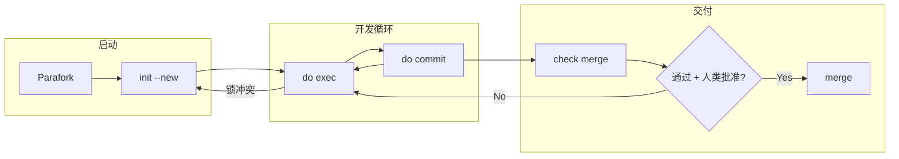

### Parafork是一个基于git worktree的并行多会话开发skill
##### compatibility:
支持在windows/linux/wsl下使用

##### how to install：
复制parafork文件夹添加到skills文件夹即可

##### how to use：
教程（准备中）

##### flowchart：

```mermaid
flowchart LR
    subgraph S1[启动]
        A[Parafork] --> B[init --new]
    end

    subgraph S2[开发循环]
        C[do exec] --> D[do commit]
        D --> C
    end

    subgraph S3[交付]
        E[check merge] --> F{通过 + 人类批准?}
        F -->|Yes| G[merge]
    end

    B --> C
    D --> E
    F -->|No| C
    C -->|锁冲突| B

```