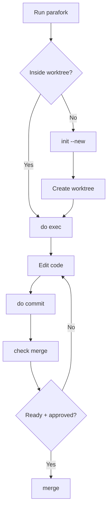

parafork是一个基于git worktree的并行多会话开发skill
支持在windows/linux/wsl下使用

how to install：
复制parafork文件夹添加到skills文件夹即可

流程图简述：

```mermaid
flowchart TD
    A[Run parafork] --> B{Inside worktree?}
    B -->|No| C[init --new]
    B -->|Yes| D[do exec]

    C --> E[Create worktree]
    E --> D

    D --> F[Edit code]
    F --> G[do commit]
    G --> H[check merge]
    H --> I{Ready + approved?}
    I -->|Yes| J[merge]
    I -->|No| F

```