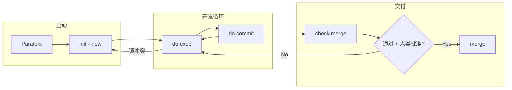

### Repo structure：
- Parafork [Skill文件夹]
- Examples [用于存储教程中的示例网页]

#### Parafork
>**Parafork = (Parallel + Fork)**

基于git worktree的会话隔离Skill，用于多窗口并发，使每窗口专注于单组任务，提高效率并减轻agent心智负担

##### How to install：
复制parafork文件夹添加到skills文件夹即可

##### Flowchart：

##### Compatibility:
支持在windows/linux/wsl下使用

##### How to use：
系列教程：
https://linux.do/t/topic/1576236
https://linux.do/t/topic/1582546
